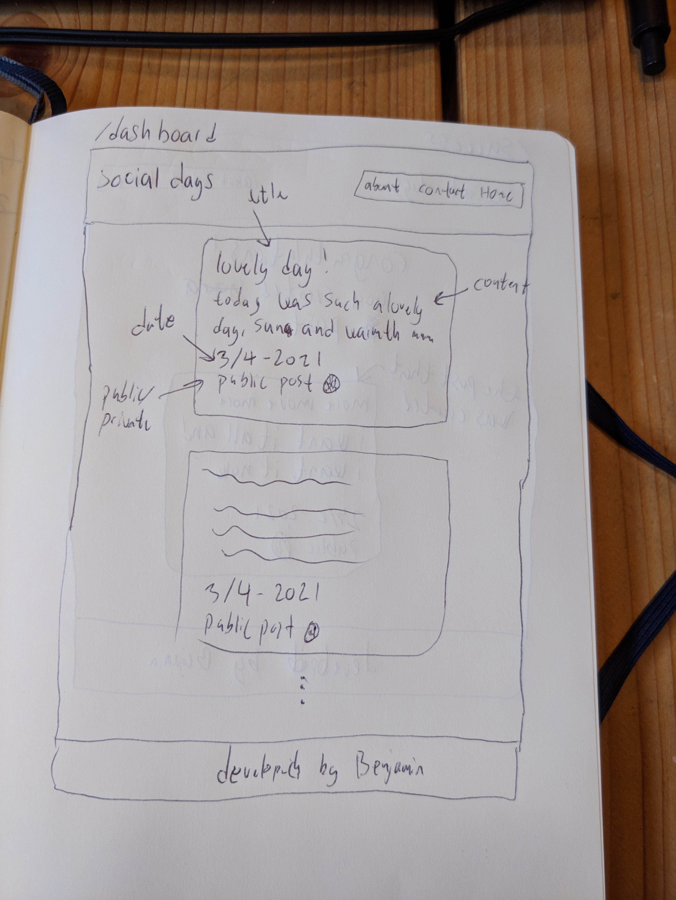
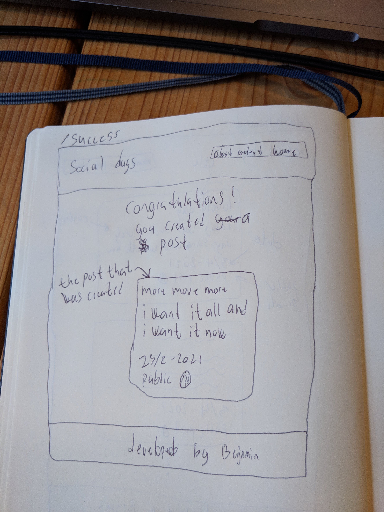

# Thymeleaf

Go here for online version: https://behu.gitbook.io/kea/week-8/thymeleaf


## Before we start

- **Uddannelses- og Forskningsministeriet**
- Portfolio questions or questions from last weeks exercise?


## Why are we even talking about thymeleaf?

Writing html directly in `Java` is very bad practice. Its also just not a pleasant experience. Like look at this:

```java
public String signUp() {
    return "<form action=\"/sign-up\" method=\"POST\">\n" +
            "            <input name=\"name\" placeholder=\"Put in your name\" type=\"text\">\n" +
            "            <input name=\"age\" placeholder=\"Put in your age\" type=\"text\">\n" +
            "            <button>Create new user</button>\n" +
            "        </form>";
}
```

Yikes...

---

When writing code its always good to seperate things out. We saw this with `html`, `css` and `js` aswell. Dont write css in your html, dont write js in your html and so forth. One of many reasons for this is that as a developer it can be hard to fx fix a problem if things are not separated. Imagine you are having a styling issue but you cannot find the issue in the css file. Now you have to look through html files aswell. This can be a huge pain in the a**. 

The same goes for Springboot applications! If we have a problem with some html, we expect to be able to fix that problem in an html file, not in some  `java` class!

This is where Thymeleaf comes in, it helps us with working in html files even though we have a java application!


## Learning goals

- Understand what Thymeleaf does and why we use it
- Create a simple template and use that template at an endpoint
- Sending data from the controller into the template using  `Model`


## What is Thymeleaf

Thymeleaf is a templating engine. It takes care of the view part of MVC (Model, View, Controller). In our case the view willl always be rendered in html. So Thymeleaf will serverside render our html.

- Thymeleaf helps us work with html files even though we are working in a java application
- It also helps us send data from the controller into the view (the html file)

There are other templating engines out there, but Thymeleaf is well supported and documented and seems to be the main templating engine.


### Installing Thymeleaf

When initializing your new project, add the `spring-boot-starter-thymeleaf` using the Spring Initializr


## Writing your first template

To create your first template, lets first create a simple hello-world example:


**Controller**

First lets create the controller. This controller handles the request that comes to `/hello-world`

To return a template, return the name of the template as a string. Remember to not have the `@ResponseBody` annotation. 

```java
@GetMapping(value = "hello-world")
public String renderHelloWorld() {
    return "hello-world.html";
}
```


**View**

To get a template to work, save the template under the location  `src/main/resources/templates`. The `templates` folder you have to create if it is not already there

The template below is called `src/main/resources/templates/hello-world.html`

```html
<!DOCTYPE html>
<html lang="en" xmlns:th="http://www.thymeleaf.org">
  <head>
      <title>Hello world</title>
  </head>
  <body>
      <main>
          <h1>Hello world</h1>
          <h2>This is our first template</h2>
      </main>
  </body>
</html>
```

`<!DOCTYPE html>`  tells the browser which version of html we will be using

There is one thing here that is different from a regular html file: ` xmlns:th="http://www.thymeleaf.org"`

This line prevents our IDE from complaining about the lack of a namespace definition for all those `th:*` attributes that we will be seeing in a second. 


You can also create folders in the `templates` folder. Then in the controller you just also add the folder to the return fx `return products/product-header.html`


## Accessing data

Now we have created a simple example that renders some html. But what if we wanted to send some data from the controller into the view. For that we use the `Model` class. 

This concept of having attributes available in the view is in thymeleaf language called context variables

**View**

```html
<!DOCTYPE html>
<html lang="en" xmlns:th="http://www.thymeleaf.org">
<head>
    <meta charset="UTF-8">
    <title>Product</title>
</head>
  <body>
    <main>
        <h1 th:text="${title}">Default title</h1>
        <span th:text="${price}">Default title</span>
        <ul th:each="feature : ${features}">
            <li th:text="${feature}"></li>
        </ul>
    </main>
  </body>
</html>
```

Again there are is a few things going on here:

- `th:text="${title}"` - This is how we render a variable in Thymeleaf. We indicate the type using the `ht:text` and then we write the kind of weird `${title}`. This is called a variable expressions. `title` is coming from the controller. If `title` is `null` then the `Default title` will be shown
-  `th:each="feature : ${features}"` - This is how we render a list in Thymeleaf. `features` is coming from the controller. 

This weird kind of language is called [Spring EL](http://docs.spring.io/spring-framework/docs/current/spring-framework-reference/html/expressions.html) expression. In short, Spring EL (Spring Expression Language) is a  language that supports querying and manipulating an object graph at  runtime - from https://www.thymeleaf.org/doc/articles/springmvcaccessdata.html


**Controller**

```java
@GetMapping(value = "/product")
public String renderProduct(Model model) {
    String title = "Television";
    int price = 1000;
    ArrayList<String> features = new ArrayList<>();
    features.add("HD");
    features.add("Smart TV");
    features.add("Netflix");

    model.addAttribute("title", title);
    model.addAttribute("price", price);
    model.addAttribute("features", features);

    return "product.html";
}
```

Using the `model` we can add attributes to the view using `addAttribute`. This method takes the key of the attribute ann then the value. You done need to do more with the `model` simply add the attributes and that's it.


### Adding css

Thymeleaf expects that templates are put in the `resources/templates` folder. For adding `css` and `javascript` that should be done in the `resources/static` folder. 

In the `resources/static` folder, create a new folder called `styles`. In this folder we will have all our styles for the site. In this folder you will add your `main.css` file. 

Now to add the css file to html add this line to your `head` tag: `<link th:href="@{/styles/main.css}" rel="stylesheet" />`. The `@` is a reference to a link.

Now try and add a simple stylesheet that sets the background color of the body to black:

```css
body {
    background-color: red;
}
```

If the background color is black it works


### Exercise 60 min

We just **landed a rover on Mars millions kilometres from here**, how cool is that not 🪐👽🚀 https://www.youtube.com/watch?v=4czjS9h4Fpg

Lets stay in the space topic and create a website that shows the number of people in space right now!

Use this boilerplate to get started on the project: https://github.com/behu-kea/astronauts-in-space-boilerplate. First investigate how the application works. Then it's time to create some views!


##### Creating the view

Using Thymeleaf recreate this design: https://www.howmanypeopleareinspacerightnow.com/

We dont have access to things like the nationality, position and number of days. But we have the craft. So for displaying the astronauts. Show the name in the left side and the craft in the right side!

Also add a `header` and a `footer` to the site

Focus on getting thymeleaf to work and writing good html! When you have done that you can start on the styling. 


## Continue on Social media exercise - rest of class

Today we will be continuing work on the social media we started creating Monday. 

If you did not get to do any work on the exercises and would like to start from scratch, then write me and i will give the solution for mondays exercise. 


| Url/endpoint   | Description                                                  | Request method |
| -------------- | ------------------------------------------------------------ | -------------- |
| `/dashboard`   | Render all the public posts. Remember to add the `header` and the `footer ` shown in the design! | `GET`          |
| `/submit`      | Is where a user can create a new social media post using a form. (should be created by now). Remember to add a `header` and a `footer `. How you implement the design for this page is up to you. | `GET`          |
| `/success`     | This is the page that shows that the social media post was successfully created. See the mockup! Should contain a link to go back to `/dashboard` (i for got to add this in the mockup) | `GET`          |
| /              | Add a home page for your site. Add a header, title, h1, and a good description of the site. Maybe you want to add an image aswell. Its up to you how it should look | `GET`          |
| `/submit-post` | Where the `@PostMapping`  exists. This is where the data from the form is submitted! See more information about this page below | `POST`         |


#### `/submit-post`

There are a few things going on in this endpoint:

- It gets the data sent from the `form`
- It should create a new `Post` object. `Post post = new Post(title, content, date, ...)`
- It should add the post to some `ArrayList` where you will store all the posts created. `posts.add(post)`
- Redirect to the `/success` page! 
  - In the `/success` page you need to render the `title`, `content`, `date` and `public/private` of the post that was created. To do this use query parameters in a redirect (go through the teaching material from monday to find out how that works)


### Mockups

I have created some fantastic mockups with my amazing drawing skills!


#### `/dashboard`




#### `/success`




### Flow

So the flow is as follows:

1. User fills in information in the `form` found at  `/submit`
2. After the post is created the user is redirected to `/success` where the `title`, `content`, `date` and `public/private` of the post is shown. There is a link back to `/dashboard`