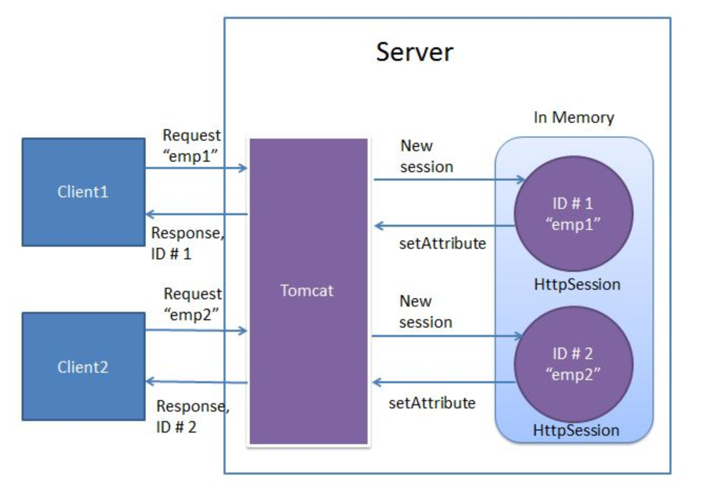

# Sessions

When developing web applications sometimes we need to store data for a user. That could fx be to save data for a logged in user. It could also be to store previous searches from a user like Google maps does. 

Now the problem with that is that HTTP is stateless. This means that there is no state stored in a request. Each request is a completely new request.


This problem is solved using sessions. 


## Learning objectives

- What is a session and why do we use it?
- Implementing session for spring boot
- Rendering sessions using Thymeleaf


## Sessions

In Spring boot sessions is implemented using cookies. Cookies is a small text file saved in the browser. This small text file gives the user an id so it knows who you are! Now every time you request a page from a specific domain, the `cookie` is sent wth the request. Now the server know who requested a specific page.


Here is a screenshot of how the cookie is stored in the browser


Here is a screenshot of how the cookie id is sent in the request





### Creating a session in Spring boot

Firstly add the dependency that makes the sessions work:

```xml
<dependency>
    <groupId>org.springframework.session</groupId>
    <artifactId>spring-session-core</artifactId>
</dependency>
```


For creating the session in Spring boot we will be working with two specific classes:

- `HttpServletRequest` - Represents the request. It lives from the controller receives the request to a response is sent to the browser. Once the `request` object has been responded, the `request` object will be deleted. Said another way: The request scope ends when the associated response is finished.
- `HttpSession` - The session lives across multiple requests. The session scope ends when the session has been timed out by the client or server. 


Let's get to a real example:

```java
@GetMapping("/set-session")
@ResponseBody
public String setSession(HttpServletRequest request) {
    HttpSession session = request.getSession();
    session.setAttribute("username", "CookieMonster42");
  
    return "Username saved in the session";
}

@GetMapping("/get-session")
@ResponseBody
public String getSession(HttpServletRequest request) {
    HttpSession session = request.getSession();
    String username = (String) session.getAttribute("username");
  
    return username;
}

@GetMapping("/invalidate-session")
@ResponseBody
public String invalidateSession(HttpServletRequest request) {
    HttpSession session = request.getSession();
  	session.invalidate();

  	return "Session invalidated";
}
```

Lets disect what happens here:

There are 3 endpoints

1. `/set-session` - Here we save the value (`"CookieMonster42"`) that is stored under the key `"username"`
2. `/get-session` - Here we get the value stored under the `"username"` key
3. `/invalidate-session` - Here we invalidate (delete) the session


Let's dive into some of the code

- `request.getSession() ` to get the session we use the `getSession` method on the `request`

- `session.setAttribute("key", "value")` - Will save some data in the session. It will be in a key value format. Save this value at this key

- `session.getAttribute("key")` - Will get some value at the specified key
- `session.invalidate()` will invalidate/delete the session


Lets try and manually delete the cookie and see what happens.


### Session storage

For now the session is stored in memory in the spring boot application. It is possible to store it in a database aswell. 


### Session timeout

To decide how long the session should be kept alive add the following to the `application.properties` file

```java
server.servlet.session.timeout=60s
```

Minimum timeout is 60 seconds


https://docs.spring.io/spring-session/docs/current/reference/html5/guides/java-jdbc.html

https://attacomsian.com/blog/thymeleaf-get-session-attributes


### What can i save?

Anything you would like! `String`, `Integer`, `ArrayList`, some class it does not matter!


```java
@GetMapping("/set-users")
@ResponseBody
public String setSession(HttpServletRequest request) {
    HttpSession session = request.getSession();
    ArrayList<Session> users = new ArrayList<>();
    User user1 = new Session("benjamin", 23);
    User user2 = new Session("peter", 45);
    users.add(user1);
    users.add(user2);
    session.setAttribute("users", users);

    return "two users saved in the session";
}

@GetMapping("/get-session")
@ResponseBody
public String getSession(HttpServletRequest request) {
  HttpSession session = request.getSession();
  List<User> users = (List<User>)  session.getAttribute("users");

  return username.get(0).name;
}
```


## Sessions in Thymeleaf

To access the session in Thymeleaf simply use the `session`. We dont need to send the session from the `@Controller` to the view. 


```java
@GetMapping("/get-session-rendered")
public String getSessionRendered() {
    return "session.html";
}
```


**session.html**

```html
<div th:text="${session.username}">John Doe</div>
```


Since the sessions might not be there, its a good idea to check if they session data is available first:

```html
<div th:if="${session.containsKey('username')}" th:text="${session.email}"></div>
```


We can also use `session.size()` and `session.isEmpty()`


## Exercise time!

- Google maps der gemmer dine sidste søgninger
- Opretter en ordre der er persistent
- En hjemmeside til at bestille kebab
- En hjemmeside til at vise vejret. Man gemmer sin lokation, navn, men man kan gemme flere destinationer med lokation og navn.


## Glossary

Contains words and their explanation