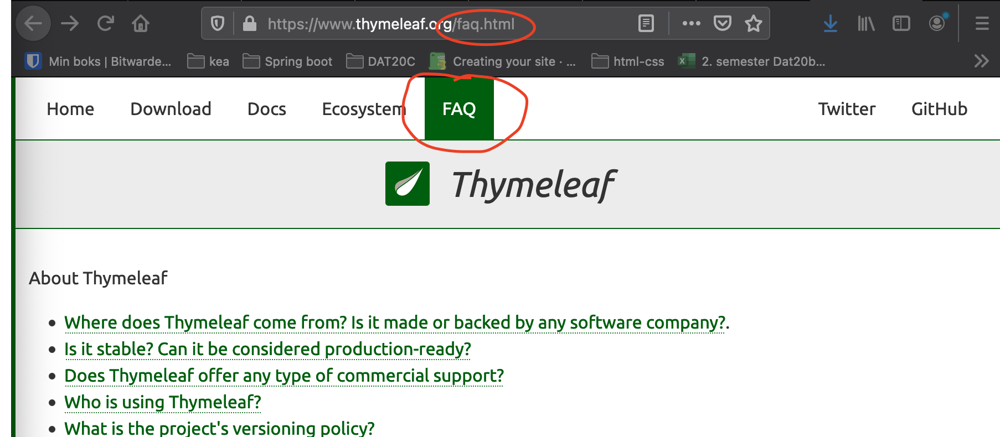

# Thymeleaf continued

Last week we familarized ourselves with Thymeleaf. We can use Thymeleaf for more advanced scenarios that we will be looking at today.


## Why are we even continuing talking about Thymeleaf

Thymeleaf is a powerful system and can do things like fragments, translation, and logic. This can be super useful when developing a site.


## Learning goals

- More advanced thymelear syntax
- Thymeleaf fragments
- Iterating a list of objects


## Thymeleaf syntax

There is quite a bit of detail in the Thymeleaf syntax. I will be talking about a few of them: https://www.thymeleaf.org/doc/tutorials/3.0/usingthymeleaf.html#standard-expression-syntax


### If

https://www.baeldung.com/spring-thymeleaf-conditionals

```html
<td>
    <span th:if="${teacher.gender == 'F'}">Female</span>
    <span th:unless="${teacher.gender == 'F'}">Male</span>
</td>
```


### Switch

https://www.baeldung.com/spring-thymeleaf-conditionals

```html
<td th:switch="${numberOfCourses}">
    <span th:case="'0'">NO COURSES YET!</span>
    <span th:case="'1'" >A course</span>
</td>
```


### Link url's

https://www.thymeleaf.org/doc/articles/standardurlsyntax.html

Relative to where the app is deployed it will give the correct url. So if running localhost the link will look like this: `http://localhost:8080/lol`

```html
<a th:href="@{/product}">product</a>
```


### Literal substitutions

```html
<span th:text="|Welcome to our application, ${user.name}!|">
```


## Fragments

On a standard website we probably have about 30 html pages. Imagine that you get the task to change the logo image in the header. Imaging going to every single one of those pages looking for the logo image, rewriting the image `src` but probably also the `alt` attribute. That would be quite a task and what if you forgot that one hidden page? Now you have the old logo showing to customers (this is something the author have literally done so its not even a thought up example 😆)

For exactly that reason we use fragments.


### What is fragments

Fragments is a way to reuse html on different pages. You could fx create a header fragment with the logo and the navigation links. Now when you create a new page, you simply use the Header fragment in that page. 


### Practical example

Lets add a `header` to another page

`src/main/resources/templates/fragments/header.html`

```html
<html xmlns:th="http://www.thymeleaf.org">
  <header>
  	<a href="/">
    	
    </a>
    <nav>
    	<ul>
        <li><a href="home">Home</a></li>
      </ul>
    </nav>
  </header>
</html>
```


`src/main/resources/templates/product.html`

```html
<!DOCTYPE html>
<html xmlnd="http://thymeleaf.org">
	<header th:replace="fragments/header.html"></header>
  <body>
    <h1>Product page</h1>
  </body>
</html>
```


### Fragment Parameters

You can pass in parameters to your fragment! And it's nearly like just calling a method

`fragments/header.html`

```html
<html xmlns:th="http://www.thymeleaf.org">
  <header>
  	<a href="/">
    	
    </a>
    <p th:text="${currentPage}"></p>
    <nav>
    	<ul>
        <li><a href="/">Home</a></li>
        <li><a href="/about">About</a></li>
      </ul>
    </nav>
  </header>
</html>
```


```html
<header th:replace="fragments/header.html(currentPage='home')"></header>
```


##### Fragment selector 

You can also select a specific part (fragment) of the fragment:

```html
<header th:replace="products/fragments/users-login.html :: logged-in"></header>
```

`/fragments/sers-login.html`

```html
<html xmlns:th="http://www.thymeleaf.org">
  <p th:fragment="logged-in">
      User logged in
  </p>
  <p th:fragment="logged-out">
      User logged out
  </p>
</html>
```


### Exercises

Continuing the social media exercise:


### `footer` - level 1

Create a new fragment called `footer.html`. You can see the `footer` here where it says `developed by Benjamin`👇

Add this `footer` fragment to your `/dashboard` page


*If you have not created a page for the `/dashboard` endpoint use the code below*


In your Controller

```java
@GetMapping("/dashboard")
public String renderEventForm() {
    return "dashboard.html";
}
```

**`src/main/resources/templates/dashboard.html`**

```html
<!DOCTYPE html>
<html lang="en" xmlns:th="http://www.thymeleaf.org">
<head>
    <meta charset="UTF-8">
    <title>Dashboard</title>
</head>
<body>
	<h1>Welcome to your Dashboard</h1>
  <!--
	This is where the footer fragment should go!
	-->
	</body>
</html>
```


Now you need to figure out how to add the `footer` fragment to the dashboard page 


### `head` - level 2

Lets create the `head` tag as a fragment for our social media site

We have 3 pages on our site (for this example we call it  `Social Media Star`): `/dashboard`, `/submit` and `/success`. When going to the 

- `/dashboard` the title should of the page should be `Social Media Star - Dashboard 📈`
- `/submit`, the title should of the page should be `Social Media Star - Create new post 💌`
- `/success`, the title should of the page should be `Social Media Star - Success 🎉`

To create a seperate title for each fragment we have to use fragment parameters!

Off course you need to add the other things in your `head` tag that you already had there. Like fx the `link` tag for the css, `meta` tag and what you now have there.

If you have not created the success page, just create the endpoint and the template file like we did with the dashboard!


### `Header` - level 3

The `header` fragment should have a parameter called `currentPage`. The value of `currentPage` is the url of the page you are currently on. That could fx be `dashboard`, `submit`, `success`, etc. In the navigation part of the `header` the current page should be highlighted (maybe with bold text or some other background color) Like seen in the screenshot below. The current page is highlighted with a green `background-color`.





 You will probably need to change a class somehow 👇


#### Changing class of an element

```html
<a href="" class="baseclass" th:classappend="${isAdmin} ? adminclass : userclass"></a>
```

If `isAdmin` is `true`, then this will result in

```html
<a href="" class="baseclass adminclass"></a>
```

